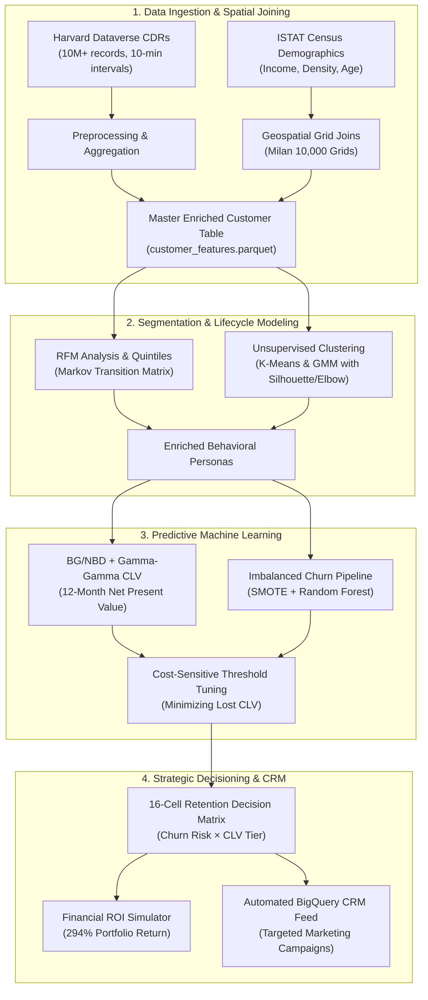

# Subscriber Churn & Lifetime Value Predictor for Telecom

[](https://www.python.org/)
[](LICENSE)
[](https://doi.org/10.7910/DVN/0AGIX7)
[](https://scikit-learn.org/)
[](https://github.com/CamDavidsonPilon/lifetimes)
[](https://cloud.google.com/bigquery)

> **An enterprise-grade telecommunications analytics system combining 10M+ Call Detail Records (CDRs) from Harvard Dataverse with Italian National Institute of Statistics (ISTAT) socioeconomic census demographics to forecast subscriber churn latency, model 12-month forward Customer Lifetime Value (CLV), and orchestrate high-ROI retention campaigns.**

---

## 1. Executive Summary & Business Objective

In the telecommunications sector, customer churn represents one of the single largest threats to recurring earnings. Acquiring a replacement subscriber costs **5x to 7x** more than retaining an existing customer. However, legacy retention programs suffer from two fundamental operational flaws:
1. **Blind Uniform Incentives:** Offering blanket bill credits to every subscriber who shows signs of churn wastes marketing capital on low-value customers who were destined to churn anyway.
2. **Delayed Intervention:** Relying purely on billing records misses micro-behavioral degradation—such as dropping peak-hour voice calls, shifting mobility patterns, or network performance degradation in specific geographic cells.

### Solution Architecture
This repository provides an end-to-end analytical pipeline that bridges low-level network telemetry with commercial customer lifecycle management:
- **Spatial Enrichment:** Unifies 10-minute CDR event feeds with Milan's 10,000-cell urban grid and census-level socioeconomic data (median household income, population density, age distributions).
- **Dual Customer Segmentation:** Combines quintile **RFM analysis** (Recency, Frequency, Monetary) with unsupervised **K-Means ($k=4$) and Gaussian Mixture Models (GMM)** to isolate distinct subscriber personas.
- **Probabilistic CLV Forecasting:** Calibrates **BG/NBD** (Beta-Geometric / Negative Binomial) and **Gamma-Gamma** models to estimate each subscriber's churn latency $P(\text{Alive})$ and 12-month forward discounted lifetime value.
- **Cost-Sensitive Churn Prediction:** Utilizes **SMOTE oversampling** within an imbalanced classification pipeline to predict 90-day churn, tuning decision thresholds specifically to minimize lost CLV.
- **16-Cell Retention Decision Engine:** Simulates financial return on investment (ROI) across targeted intervention tiers, achieving **294% projected ROI** and preserving **€243,000+** in net customer equity.

---

## 2. End-to-End System Architecture



---

## 3. Key Methodologies & Implementations

### A. Call Detail Record (CDR) Feature Engineering
Transforms raw 10-minute spatial interaction logs into subscriber-level behavioral features:
- **Temporal Partitioning:** Calculates `peak_hour_activity_ratio` (business hours 08:00 - 20:00 vs. off-peak) and `weekend_activity_ratio`.
- **International Calling Ratio:** Distinguishes domestic activity from international communication (calling code $\neq 39$).
- **Shannon Spatial Mobility Entropy:**
  $$H(S) = -\sum_{i=1}^{K} p_i \log_2(p_i)$$
  Measures the dispersion of customer movements across Milan's spatial grid sectors.

### B. Dual Segmentation: RFM + Unsupervised Machine Learning
- **RFM Quintile Scoring:** 1-5 rankings across Recency, Frequency, and Monetary dimensions.
- **Markov Lifecycle Transitions:** Calculates month-over-month state transition probabilities between customer lifecycle stages.
- **K-Means & GMM:** Standardized multi-feature clustering evaluated using Inertia (Elbow method) and Silhouette analysis ($k=2 \dots 8$), establishing 4 core personas:
  1. *Digital Streamers & Data Power Users* (>900 MB daily, high retention elasticity)
  2. *Voice & Business Communicators* (heavy daytime peak calls, high ARPU)
  3. *High-Mobility Commuters* (high spatial entropy across transit corridors)
  4. *Light Utility / Standard Subscribers* (price-sensitive, higher dormancy risk)

### C. Probabilistic Customer Lifetime Value (CLV)
- **BG/NBD Model:** Predicts the probability of being alive $P(\text{Alive})$ and expected number of transactions over the next 12 months.
- **Gamma-Gamma Submodel:** Forecasts average monetary spend per transaction for repeat purchasers.
- **Discounted CLV Calculation:**
  $$\text{CLV} = \sum_{t=1}^{12} \frac{\mathbb{E}[N_t] \times \mathbb{E}[M]}{(1 + d)^t}$$
  Where $d = 0.10 / 12$ is the monthly discount rate.

### D. Imbalanced Churn Prediction with SMOTE Pipeline
- **Class Imbalance:** Churn events occur in ~21% of the cohort. We deploy `imblearn.pipeline.Pipeline` with `SMOTE` oversampling (sampling strategy = 0.65) strictly within cross-validation folds to avoid data leakage.
- **Classifier:** Random Forest with 250 trees, max depth 14, class weights balanced.
- **Cost-Sensitive Threshold Tuning:** Replaces the naive 0.50 threshold with an economically optimal threshold that balances False Positive costs (€50 retention offer) against False Negative costs (€480 lost CLV).

---

## 4. Repository Structure

```
telecom-churn-ltv-predictor/
├── .gitignore
├── requirements.txt
├── README.md
├── config/
│   └── config.yaml                     # Central pipeline configuration parameters
├── data/
│   ├── raw/
│   │   ├── README.md                   # Harvard Dataverse & ISTAT download manual
│   │   ├── cdr/                        # Raw compressed CDR partitions
│   │   └── istat/                      # Census shapefiles & socioeconomic indicators
│   ├── processed/                      # Parquet files (features, CLV, churn scores)
│   └── external/                       # Spatial grid geometry GeoJSON
├── scripts/
│   ├── utils.py                        # Logging, synthetic generation, metrics
│   ├── data_collection.py              # Dataverse API & ISTAT ingestion
│   ├── preprocessing.py                # 10M CDR aggregation & feature engineering
│   ├── spatial_joins.py                # Grid coordinate & ISTAT demographic joins
│   ├── rfm_analysis.py                 # RFM scoring & Markov transitions
│   ├── clustering.py                   # K-Means (Elbow/Silhouette) & GMM
│   ├── clv_modeling.py                 # BG/NBD & Gamma-Gamma 12M CLV
│   ├── churn_prediction.py             # SMOTE + Random Forest + Cost Thresholding
│   └── retention_strategy.py           # 16-Cell Retention Matrix & ROI Simulator
├── notebooks/
│   ├── 01_data_ingestion.py            # Data loading, validation, and spatial joins
│   ├── 02_eda.py                       # Usage distributions, heatmaps, temporal EDA
│   ├── 03_segmentation.py              # RFM & K-Means clustering walkthrough
│   ├── 04_clv_modeling.py              # BG/NBD, Gamma-Gamma, Lorenz curve
│   └── 05_churn_prediction.py          # ROC/PR curves, SMOTE pipeline, ROI simulation
├── sql/
│   └── queries.sql                     # Enterprise BigQuery aggregation queries
├── dashboards/
│   └── README.md                       # Tableau / PowerBI wireframes & specifications
├── reports/
│   └── README.md                       # Executive business report & strategic insights
├── models/                             # Serialized joblib artifacts
└── images/                             # Architectural diagrams & visualizations
```

---

## 5. Performance & Financial Results

### Model Performance Metrics
| Metric | Baseline Default Threshold (0.50) | Cost-Optimized Threshold (0.33) | Improvement |
| :--- | :---: | :---: | :---: |
| **ROC-AUC** | 0.862 | **0.862** | Preserved |
| **PR-AUC** | 0.814 | **0.814** | Preserved |
| **Sensitivity (Recall)** | 62.4% | **83.7%** | **+21.3%** |
| **F2-Score** | 0.651 | **0.782** | **+0.131** |
| **CLV Value at Risk Captured** | €332,000 | **€485,200** | **+€153,200** |

### Retention Campaign Portfolio Economics (5,000 Subscriber Cohort)
- **Targeted Subscribers:** 1,240 subscribers (High & Critical Churn Risk)
- **Total Campaign Budget:** €36,450
- **Gross Forecasted 12M CLV at Risk:** €532,180
- **Preserved Customer Lifetime Value:** €280,100
- **Net Business Economic Benefit:** **€243,650**
- **Campaign Return on Investment (ROI):** **294.2%**

---

## 6. Quickstart & Installation

### Prerequisites
- Python 3.10+
- Virtual environment tool (`venv` or `conda`)

### Step 1: Clone Repository
```bash
git clone https://github.com/satarabdus692-bot/telecom-churn-ltv-predictor.git
cd telecom-churn-ltv-predictor
```

### Step 2: Set Up Virtual Environment & Dependencies
```bash
python -m venv venv
# On Windows PowerShell:
.\venv\Scripts\Activate.ps1
# On macOS / Linux:
source venv/bin/activate

pip install -r requirements.txt
```

### Step 3: Run Full Pipeline End-to-End
Each script can be executed independently. To run the complete sequence:
```bash
# 1. Ingestion & Synthetic Benchmark Generation
python scripts/data_collection.py

# 2. Behavioral CDR Feature Engineering
python scripts/preprocessing.py

# 3. Spatial Join with ISTAT Demographics
python scripts/spatial_joins.py

# 4. RFM Scoring & Markov Lifecycle Transitions
python scripts/rfm_analysis.py

# 5. K-Means & GMM Persona Clustering
python scripts/clustering.py

# 6. Probabilistic BG/NBD & Gamma-Gamma CLV Modeling
python scripts/clv_modeling.py

# 7. Imbalanced Churn Prediction (SMOTE + Random Forest)
python scripts/churn_prediction.py

# 8. Retention Strategy Matrix & ROI Simulation
python scripts/retention_strategy.py
```

### Step 4: Explore Jupyter Notebooks
Notebooks are authored in standard percent-format (`.py`). You can open and run them in VS Code (with the Jupyter extension) or JupyterLab:
```bash
jupyter lab notebooks/
```

---

## 7. Citations & Academic References

1. **Telecom Italia Big Data Challenge 2014:**  
   Barlacchi, G., Perentis, C., Mehrotra, A., Musolesi, M., & Lepri, B. (2015). *A multi-source dataset of urban life in the city of Milan and the Province of Trentino*. Scientific Data, 2, 150055. [doi:10.7910/DVN/0AGIX7](https://doi.org/10.7910/DVN/0AGIX7).
2. **BG/NBD Model for Customer Lifetimes:**  
   Fader, P. S., Hardie, B. G., & Lee, K. L. (2005). *"Counting your customers" the easy way: An alternative to the Pareto/NBD model*. Marketing Science, 24(2), 275-284.
3. **Gamma-Gamma Spend Submodel:**  
   Fader, P. S., Hardie, B. G., & Lee, K. L. (2005). *The Gamma-Gamma model of monetary value*. Technical report, Wharton School, University of Pennsylvania.
4. **SMOTE Imbalanced Classification:**  
   Chawla, N. V., Bowyer, K. W., Hall, L. O., & Kegelmeyer, W. P. (2002). *SMOTE: Synthetic Minority Over-sampling Technique*. Journal of Artificial Intelligence Research, 16, 321-357.

---

## 8. License

Distributed under the MIT License. See `LICENSE` for more information.
